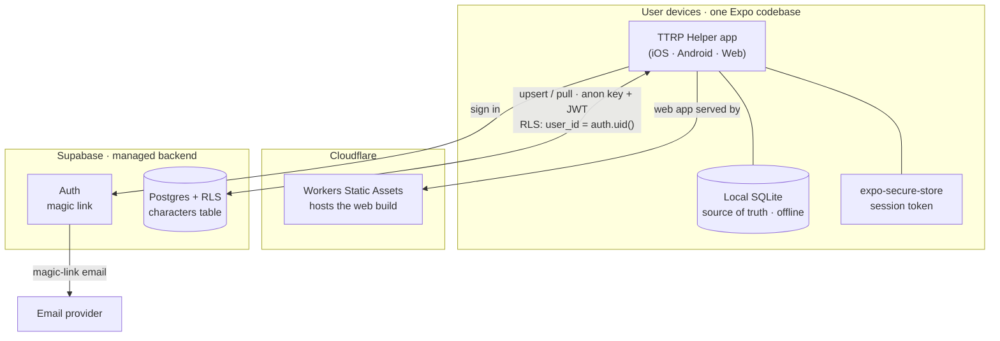
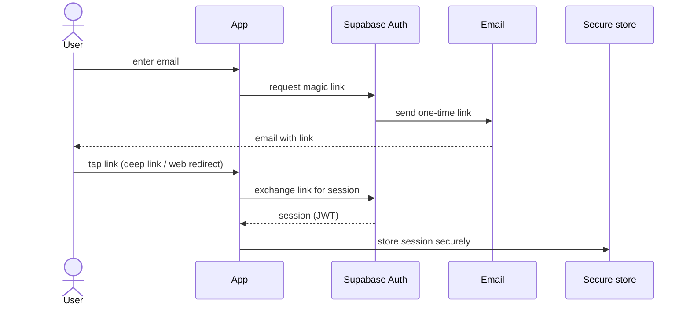

# Cloud Sync & Accounts — Design

**Date:** 2026-06-29
**Status:** Approved design (brainstorming) → ready for implementation plan
**Topic:** Optional cloud sync + backup with user accounts, layered on the existing offline-first app.

## Context

TTRP Helper is a mobile-first, **offline-first** character sheet app (D&D 5e + WFRP 4e), built solo a few hours a week. Characters are stored locally in `expo-sqlite` (native) / `wa-sqlite` (web) as a thin shell plus a per-character JSON `data` blob, discriminated by a `system` column. The web build is hosted on **Cloudflare** (Workers Static Assets, static SPA). There is currently **no backend, auth, or sync**.

This design adds **optional cross-device sync + cloud backup** for a single user's own data, without breaking the offline-first, no-login-required experience that is the product's competitive wedge.

> This is a deliberate, owner-approved departure from the original `PROJECT_BRIEF.md` hard constraint ("no backend / no auth / no sync"). It moves the brief's deferred *cross-device sync* and *cloud backup* items into active scope.

## Goals

- Cross-device sync of a user's own characters (phone + laptop + web), kept **fresh on app open**.
- Cloud **backup / recovery** (restore characters on a new or reinstalled device).
- **Preserve offline-first:** the app works fully with no account or connection. Signing in *adds* sync.
- **Secure authentication with no password-recovery burden.**

## Non-goals (explicitly out of scope)

- Sharing characters / party / GM tools / multi-user collaboration.
- Real-time live sync (edits appearing on another *already-open* device within seconds).
- Server-gated monetization / web-account paywalls.
- Syncing settings, dice macros, or content overlays — **characters only**, for now.

## Decisions

| Area | Decision |
|---|---|
| Backend | **Supabase** (managed: Postgres + Auth + Row-Level Security). Buy, don't build. |
| Web hosting | **Cloudflare stays** (static SPA). Supabase is a separate backend the app calls directly. |
| Auth | **Magic link (passwordless email)** to start — no passwords stored or recovered. Social (Google/Apple) and email+password are optional later additions. |
| Accounts | **Optional.** App fully usable signed-out (current behavior). Sign-in enables sync. |
| Sync model | **Local-first, last-write-wins per character**, by DB server `updated_at`. Pull-on-open + background push. Soft-delete tombstones. No real-time. |
| Data shape | Cloud **mirrors** local: one `characters` table, per-character JSON `data`. No remodeling. |

## Architecture

Each device keeps its **local SQLite as the source of truth** and works offline. When signed in, a sync module mirrors the user's characters to a private Supabase Postgres table; the cloud copy doubles as backup. Cloudflare continues to host the web app unchanged. The app talks to Supabase directly over HTTPS using the public **anon** key — data isolation is enforced by the database via Row-Level Security, not by app code.

### Architecture & flow diagrams

**Services and how they connect:**



**Login flow (magic link):**



**Sync flow (local-first, last-write-wins):**

```mermaid
sequenceDiagram
  participant A as App
  participant L as Local SQLite
  participant DB as Supabase (Postgres + RLS)
  Note over A,L: On save — offline-first
  A->>L: write character (instant)
  A->>DB: background upsert (id, user_id, system, data)
  Note over A,DB: On app open / sign-in
  A->>DB: pull rows where updated_at > last_synced_at
  DB-->>A: changed rows + tombstones
  A->>L: apply last-write-wins per character; honor deleted_at
```

### Data model (Supabase `characters` table)

- `id uuid primary key` — matches the local character id
- `user_id uuid not null references auth.users` — the owner
- `system text not null` — `'dnd5e' | 'wfrp4e'`
- `data jsonb not null` — the same per-character JSON stored locally
- `updated_at timestamptz not null default now()` — **server clock**, drives last-write-wins
- `deleted_at timestamptz` — tombstone; `null` = live

**Row-Level Security:** enable RLS; a single policy makes a row selectable/insertable/updatable/deletable only when `user_id = auth.uid()`. The app uses only the **anon** key; the database enforces per-user isolation.

### Auth (magic link)

Enter email → Supabase emails a one-time link → tap link (deep-link into the app on native, redirect on web) → session established → session token stored in `expo-secure-store` (Keychain / Keystore). Token refresh is handled by the Supabase client. No password is stored, leaked, or recovered.

### Sync model (local-first, last-write-wins)

- **On save:** write to local SQLite first (instant, offline-safe) → enqueue a background upsert to Supabase (`id`, `user_id`, `system`, `data`; `updated_at` set by the DB).
- **On app open / sign-in:** pull rows where `updated_at > last_synced_at`; per character, the newer `updated_at` wins (whole-character replace into local). Persist `last_synced_at`.
- **Deletes:** set `deleted_at` (never hard-delete) so deletions propagate; reconcile tombstones into local deletes.
- **Conflicts:** rare for one user's own devices; the later edit wins at character granularity. Acceptable per the chosen "fresh on open" model.
- **Local schema additions:** ensure each local character row carries an `updated_at`; add a tombstone mechanism so deletes can sync rather than vanishing silently.

## Build order (incremental — each phase ships value)

- **Phase 0 — Setup (no app code):** create a Supabase project (free tier); create the `characters` table; **enable RLS + the `user_id = auth.uid()` policy**; enable Email magic-link auth; configure redirect / deep-link URLs (including the Cloudflare web domain).
- **Phase 1 — Auth only:** add `@supabase/supabase-js` + `expo-secure-store`; a "Sign in" row in Settings (enter email → tap link → session restored); app stays fully usable signed-out. Ship and live on it.
- **Phase 2 — Backup (one-way):** on save, upsert the row to Supabase; on sign-in, pull the user's rows into local. Delivers cloud backup + restore-on-new-device.
- **Phase 3 — Two-way sync:** track `last_synced_at`; pull changed rows on open; last-write-wins per character; honor `deleted_at` tombstones; queue offline edits for background retry.
- **Phase 4 — Harden:** session-refresh edge cases, "syncing…" indicator, account + data deletion, error / empty / offline states.

## Pitfalls / guardrails

- Ship only the **anon** key; **never** the `service_role` key in the client (it bypasses RLS = full DB access).
- **Enable RLS before any real data** — a table without it is readable by anyone with the anon key.
- Keep **local-first**; the cloud is a mirror, never the source of truth (avoid offline blank screens).
- Use **DB server time** (`updated_at default now()`) for last-write-wins, not device clocks.
- **Soft-delete tombstones**, or deleted characters resurrect on the next sync.
- **Never block saving on the network** — push in the background.
- **New privacy duty:** storing email + data on a server requires a privacy policy and an in-app account/data-deletion path.
- Keep the existing **single character-normalization point** (migrate-on-load) authoritative for both local and pulled-cloud rows, so JSON schema changes stay consistent.

## Cost

Supabase **free tier** (500 MB Postgres, 50k monthly-active auth users) comfortably covers a solo / hobby app — character JSON is a few KB each. **Pro (~$25/mo)** only once you outgrow free or want always-on (free projects pause when idle). Ongoing cost: **~$0 at hobby scale, ~$25/mo at real scale** — versus the one-time $7.99 model.

## Open decisions (follow-ups before launch)

- **Sync: free vs. paid-tier unlock** — *deferred* (the brief had cloud backup as a paid unlock). Build the capability; decide gating before launch.
- **Additional auth methods** — add Google / Apple and/or email+password later if demand warrants (iOS requires "Sign in with Apple" if any social login is offered).
- **What else syncs** — settings / dice macros / content overlays are out of scope now; revisit if needed.
- **Privacy policy + account-deletion flow** — required before shipping accounts publicly.

## Success criteria

- Signed-out app behaves exactly as today (offline-first, no regression).
- A signed-in user can create a character on device A, open the app on device B, and see it; edit on B, reopen A, and see the edit (fresh-on-open).
- Deleting a character on one device removes it on the other after sync (no resurrection).
- Losing / reinstalling a device and signing back in restores all characters.
- The database denies any attempt to read another user's rows (RLS verified).
- No raw passwords or `service_role` keys exist anywhere in the client.
