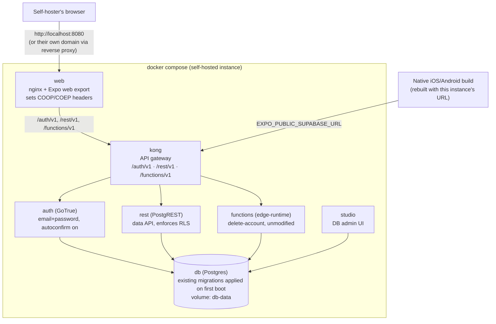

# Self-Hosted Docker Compose — Design

**Date:** 2026-08-28
**Status:** Superseded — see below. Kept as a historical record of this brainstorming session, same convention as `PROJECT_BRIEF.md`.
**Topic:** Package TTRP Helper's backend + web frontend so anyone can self-host their own instance with `docker compose up`, instead of relying on the maintainer's Supabase Cloud + Cloudflare deployment. First step toward a future, separate "openrp" project — that project is out of scope here.

> **Superseded 2026-08-28.** After this design was approved, the requirements changed: fully self-hosted (no Supabase at all, not even self-hosted) and passkey login instead of email+password. That work continues as a separate local fork, `~/Repos/ttrp-helper-selfhosted` (not pushed anywhere) — see its own [2026-08-28-self-hosted-passkey-fork-design.md](../../../../ttrp-helper-selfhosted/docs/superpowers/specs/2026-08-28-self-hosted-passkey-fork-design.md). TTRP Helper itself is unaffected and keeps Supabase + email/password + Cloudflare hosting as-is. The rest of this document is left as-is below for reference.

## Context

TTRP Helper already ships an optional cloud layer: **Supabase** (Postgres + Auth + Row-Level Security + one Edge Function, `delete-account`), added on top of the offline-first local SQLite app (see [2026-06-29-cloud-sync-and-accounts-design.md](2026-06-29-cloud-sync-and-accounts-design.md)). The app reads `EXPO_PUBLIC_SUPABASE_URL` / `EXPO_PUBLIC_SUPABASE_ANON_KEY` from env at build time and degrades to fully-local when they're absent ([src/lib/config.ts](../../../src/lib/config.ts)) — nothing in `src/sync/`, `src/auth/`, or `src/lib/supabase.ts` is hardcoded to the maintainer's own Supabase project.

The reference point for this design is **opengym** (`~/Repos/opengym`), a self-hosted fitness tracker the user has already built: a `docker-compose.yml` bundling a custom lightweight API, an nginx-served frontend, and a one-time media-download init container, configured entirely through a heavily-commented `.env`.

opengym's backend is hand-rolled (Node, JSON files on disk, no database) because its needs are simple. TTRP Helper's backend is not — it's already a tested Postgres schema with RLS policies (pgTAP tests in `supabase/tests/`) and an Edge Function. Re-implementing that as a small custom API, opengym-style, would mean throwing away real, working infrastructure to rebuild a worse version of it. The cheaper and more faithful path is to **self-host Supabase itself** via docker-compose and point the unmodified app at it.

## Goals

- `docker compose up --build` on a fresh checkout produces a fully working, self-hosted instance: sign up, create characters, sync across devices — reachable in a browser with no external account, no signup on any third-party service.
- Reuse the existing Postgres schema, migrations, RLS policies, and Edge Function as-is — no rewrite of `src/sync/`, `src/auth/`, `src/lib/supabase.ts`, or the SQL in `supabase/`.
- Zero-config-friendly first run (no SMTP setup required to sign up), with clear `.env` documentation for hardening a real deployment behind a real domain.
- Follow the project's existing "no CI/CD" constraint: self-hosters build images locally; nothing here pushes to a registry.

## Non-goals (explicitly out of scope)

- The future **openrp** project — a separate spec when that work starts.
- Supabase **Storage**, **Realtime**, or **imgproxy** — the app never calls any of these today.
- Publishing prebuilt images to a container registry, or any CI/CD to build/push them.
- Packaging or distributing native iOS/Android builds. Self-hosting covers the backend and the web frontend only; a self-hoster who wants the native apps pointed at their own instance rebuilds them with their own `EXPO_PUBLIC_SUPABASE_URL`.
- Multi-tenancy, admin tooling beyond what Supabase Studio already provides, or any product feature work.

## Decisions

| Area | Decision |
|---|---|
| Backend | Self-hosted **Supabase**, trimmed to the services this app uses: Postgres, GoTrue (auth), PostgREST (data API), Kong (gateway), Edge Runtime (functions). No Storage, Realtime, imgproxy, Studio's log pipeline, or the analytics/vector containers from Supabase's full reference compose. |
| Admin UI | **Supabase Studio included** — one more container, but gives a self-hoster a DB browser without needing `psql`. |
| Web frontend | New `web/` service: multi-stage Dockerfile (Node build → nginx serve), mirroring opengym's `web/Dockerfile` shape. Must set `Cross-Origin-Opener-Policy: same-origin` and `Cross-Origin-Embedder-Policy: require-corp` on every response — `wa-sqlite`/OPFS needs cross-origin isolation, currently provided only by Cloudflare's `public/_headers` in the hosted deployment. |
| Migrations | Existing `supabase/migrations/*.sql` mounted into the `db` container's `/docker-entrypoint-initdb.d/migrations/`. Postgres only runs init scripts against an empty data directory, so this applies once on first boot — no separate migration-runner container needed, and restarts are inherently idempotent. |
| Email confirmation | **Off by default** (`GOTRUE_MAILER_AUTOCONFIRM=true`) so signup works with zero SMTP setup. `.env.example` documents turning it (and SMTP) on for a real deployment. |
| Secrets | `.env.example` holds `POSTGRES_PASSWORD`, `JWT_SECRET`, `ANON_KEY`, `SERVICE_ROLE_KEY`, `DASHBOARD_PASSWORD` (Studio login). A new `scripts/generate-secrets.mjs` derives a consistent `JWT_SECRET`/`ANON_KEY`/`SERVICE_ROLE_KEY` triple (the two keys are HMAC-SHA256 JWTs signed by the secret — picking them independently is the most common way self-hosted Supabase setups break) and prints a paste-ready block. |
| Networking | `WEB_PORT` (default 8080) for the frontend; `KONG_HTTP_PORT` for the API gateway; `SITE_URL` / `API_EXTERNAL_URL` for a self-hoster's own domain when they put a reverse proxy in front (analogous to opengym's `RP_ID`/`ORIGIN`, minus WebAuthn hostname binding — this app uses email+password, not passkeys). |
| Image distribution | Build-only (`build:` in compose, `docker compose up --build`). No registry, no CI/CD, matching the project's existing "no CI/CD" rule. |

## Architecture



The app code is unaware of the difference between Supabase Cloud and this stack — `EXPO_PUBLIC_SUPABASE_URL` just points at wherever `kong` is reachable, and `supabase-js` speaks the same REST/Auth/Functions protocol either way.

## File layout (new)

```
docker-compose.yml            # top-level, all services above
.env.example                  # heavily commented, opengym style
docker/kong.yml                # declarative Kong route config (auth/rest/functions)
web/Dockerfile                 # multi-stage: npm run build:web → nginx
web/nginx.conf.template        # serves dist/, sets COOP/COEP, proxies nothing (Kong is separate)
scripts/generate-secrets.mjs   # derives JWT_SECRET/ANON_KEY/SERVICE_ROLE_KEY, prints .env block
docs/SELF_HOSTING.md           # setup steps, backup guidance, reverse-proxy/HTTPS notes,
                                # native-build note, troubleshooting (COOP/COEP gotcha first)
```

`supabase/migrations/` and `supabase/functions/delete-account/` are reused by mount, not copied.

## First-run flow

1. `cp .env.example .env`
2. `node scripts/generate-secrets.mjs >> .env` (or paste its output manually)
3. `docker compose up --build`
4. Open `http://localhost:8080`, sign up, start creating characters.

Backing up an instance is backing up the `db-data` volume — documented in `docs/SELF_HOSTING.md`.

## Known gotchas (call out prominently in docs)

- **COOP/COEP headers are load-bearing.** Without them on the `web` container's responses, `wa-sqlite`/OPFS fails to initialize on the self-hosted web build with a confusing error, not an obvious "missing header" one. This gets verified manually before calling the work done.
- **`JWT_SECRET`, `ANON_KEY`, and `SERVICE_ROLE_KEY` are not independent values** — they must come from the generator script together. A hand-edited `.env` with a fresh `JWT_SECRET` but old keys (or vice versa) fails auth in a way that looks like a network problem.
- **Native builds are baked, not runtime-configurable.** Pointing a phone build at a self-hosted instance means rebuilding the app with that instance's URL — this compose stack doesn't touch that path at all.

## Testing / verification plan

- `docker compose up --build` from a clean checkout (no pre-existing volumes) succeeds and all services report healthy.
- Sign up a new account through the `web` container with no SMTP configured — confirms autoconfirm works.
- Create a character, confirm it round-trips through `rest` (PostgREST) and is visible via `studio`.
- Delete the account, confirm the `functions` (delete-account) container handled it.
- Reload the web app after signing in — confirms COOP/COEP headers are present and OPFS/wa-sqlite initializes (this is the one step most likely to silently fail; verify explicitly, don't assume).
- Restart the whole stack (`docker compose down && docker compose up`) — confirms migrations do **not** re-run destructively and existing data survives.
