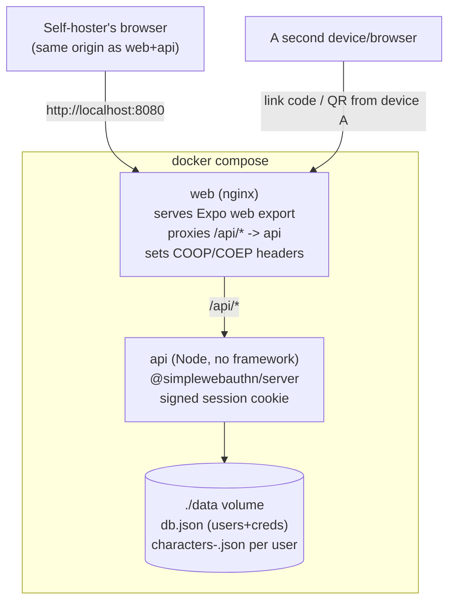

# Self-Hosted Passkey Fork — Design

**Date:** 2026-08-28
**Status:** Approved design (brainstorming) → ready for implementation plan
**Topic:** A fully self-hosted fork of TTRP Helper — Supabase replaced entirely by a custom, opengym-pattern backend (passkey auth, JSON-file storage), keeping cross-device character sync and login. Local-only repo for now; not pushed anywhere.

## Context

This repo is a fork of [TTRP Helper](../../../../TTRP-helper), a mobile-first, offline-first character sheet app (D&D 5e + WFRP 4e) built with Expo/React Native. The parent project's cloud layer is Supabase (Postgres + Auth + RLS + one Edge Function) — see its own [2026-08-28-self-hosted-docker-compose-design.md](../../../../TTRP-helper/docs/superpowers/specs/2026-08-28-self-hosted-docker-compose-design.md) for the earlier draft that self-hosted Supabase itself.

That draft was scrapped in favor of this one: rather than running a trimmed self-hosted Supabase, this fork **replaces Supabase entirely** with a small custom backend modeled directly on **opengym** (`~/Repos/opengym`) — the user's own self-hosted fitness tracker: plain `node:http` (no framework), `@simplewebauthn/server` for passkey auth, JSON files on disk instead of Postgres, a signed session cookie, and a two-container docker-compose (`api` + `web`, single origin via nginx proxy). The goal is a *completely* self-hosted, dependency-free instance — no third-party service of any kind, not even a self-run Postgres.

This fork diverges from TTRP Helper going forward. TTRP Helper itself is untouched — it keeps Supabase + email/password auth + Cloudflare hosting as-is.

## Goals

- `docker compose up --build` on a fresh checkout of *this* repo produces a fully working, single-origin, self-hosted instance reachable at `http://localhost:8080` (or a real domain via reverse proxy), with **zero external services** — no Supabase, no third-party auth, no hosted database.
- **Passkey (WebAuthn) login**, replacing email+password entirely. Web only for this pass (browser `navigator.credentials` API) — native iOS/Android passkey support (a native library, per-domain associated-files setup, dropping Expo Go for auth testing) is deferred; native builds hide the Account/sync entry point for now rather than showing something broken.
- **Cross-device sync preserved**, including across ecosystems that don't share OS-level passkey syncing (e.g. a Windows laptop and an iPhone) — via an explicit "link this device to my account" flow, not just relying on iCloud Keychain / Google Password Manager to carry one passkey around.
- **Export/import unaffected** — it's a fully local feature (`src/lib/transfer.ts`) that never touched Supabase and doesn't touch this backend either.
- Preserve the existing per-character last-write-wins sync semantics and the two-tier "remove cloud data" (soft-delete all characters, keep account) vs "delete account" (hard delete everything) actions.

## Non-goals (explicitly out of scope for this pass)

- Native (iOS/Android) passkey support — revisit once the web flow is proven.
- Any of opengym's *other* features: admin dashboard, invite-only signup, audit log, web-push notifications. Only the passkey-auth pattern and JSON-storage pattern are being reused, not the whole product.
- Publishing this repo anywhere, or any CI/CD. It stays local until the user decides otherwise.
- The separate future "openrp" project (a possible generic/open-source rename) — unrelated decision, not made here.

## Decisions

| Area | Decision |
|---|---|
| Backend | Custom Node server (`node:http`, no framework), `@simplewebauthn/server`, JSON-file storage (`db.json` for users/credentials, `characters-<uid>.json` per user), atomic writes — same shape as opengym's `api/server.js`. |
| Auth | Passkeys (WebAuthn) only. No passwords, no email, no magic links. |
| Session | Signed HMAC cookie (`sign(userId:exp:sessionVersion)`, same pattern as opengym), single origin via nginx proxy so the cookie and the WebAuthn RP ID line up cleanly. |
| Multi-device sync | **Not** opengym's "every registration = a new account" model as-is. Adds an authenticated device-linking flow (below) so a second device attaches to the *same* account instead of creating a new one. |
| Data model | Per-character upsert + tombstone (`id`, `system`, `data`, `updated_at`, `deleted_at`), matching the existing `CloudCharacter` shape — **not** opengym's single whole-blob `GET/PUT /api/data`, because that would regress the already-shipped per-character last-write-wins design (two devices editing different characters offline could otherwise clobber each other on sync). |
| Frontend | Same app code, with `src/auth/*`, `src/lib/supabase.ts`, and `src/sync/cloudCharacters.ts` reworked; `outbox.ts`/`reconcile.ts`/`syncStatus.ts`/`SyncProvider.tsx` untouched since they only depend on `cloudCharacters.ts`'s interface. `@supabase/supabase-js` and the whole `supabase/` directory (migrations, RLS, Edge Function, tests) are removed. |
| Repo | Fresh `git init`, single clean initial commit — not a clone of TTRP Helper's history, which is mostly unrelated D&D/WFRP feature work. No remote, nothing pushed. |
| Compose | Two services only: `api` and `web`. No Postgres, no Kong, no Studio, no init/media container. |

## Architecture



### Auth flow

- **Register (new account):** `POST /api/register/options` → `POST /api/register/verify`. Same shape as opengym: generates a fresh WebAuthn registration challenge, verifies the response, creates a new user + credential, sets the session cookie.
- **Login (existing account, same passkey):** `POST /api/login/options` → `POST /api/login/verify`. Unchanged from opengym.
- **Link a new device to an existing account (new — not in opengym):** While signed in on device A, `POST /api/passkey/link/options` generates a short-lived linking code plus a registration challenge tied to the *current session's* user id (not a new uid), returned for display as text/QR. On device B (not signed in), `POST /api/passkey/link/verify` takes `{code, credential}`, looks up the pending link by code, verifies the registration response, and attaches the new credential to that same existing user instead of creating one — then issues a session cookie for device B under that account. Codes are single-use and expire quickly (reuse opengym's existing short-lived challenge-store pattern).
- **Logout:** `POST /api/logout` clears the cookie.
- **Session identity:** `GET /api/me`.

### Data flow (per character)

- `GET /api/characters` — pull all of the signed-in user's rows, including tombstones (`deleted_at` set), so deletes propagate to other devices. Unchanged contract from the existing `pullCharacters()`.
- `PUT /api/characters/:id` — upsert `{system, data}`; server sets `updated_at` and returns it, exactly like the current Supabase upsert-then-read-back-timestamp pattern in `pushCharacter()`.
- `POST /api/characters/:id/delete` — soft-delete one (sets `deleted_at`), matching `softDeleteCharacterCloud()`.
- `POST /api/characters/clear` — soft-delete all of the signed-in user's characters ("remove cloud data"), matching `softDeleteAllCharacters()`.
- `POST /api/account/delete` — hard delete: the user record, all their WebAuthn credentials, and their `characters-<uid>.json` file. Replaces the Supabase Edge Function. Bumping `sessionVersion` (or simply deleting the user) invalidates any other still-signed-in device's session immediately, so a deleted account can't keep syncing from a device that was offline during the deletion.

## Frontend changes

- **`src/auth/AuthProvider.tsx`:** `signInWithPassword` / `signUp` / `sendPasswordReset` are replaced by `registerPasskey(name)`, `loginWithPasskey()`, and `linkDevice(code)` (for the receiving device) / `startDeviceLink()` (for the already-signed-in device, returns the code/QR payload). `updateDisplayName` and `deleteAccount` keep their existing shapes, calling the new endpoints. All magic-link deep-link handling (`expo-linking` usage for `?code=`) is deleted — passkeys don't need it. Passkey/Account UI is gated to `Platform.OS === 'web'`.
- **`src/lib/supabase.ts`** is deleted; a new `src/lib/api.ts` wraps `fetch` with `credentials: 'include'`, base URL from `EXPO_PUBLIC_API_URL` (analogous to today's `EXPO_PUBLIC_SUPABASE_URL`), degrading the same way `supabaseConfig.enabled` does today when unset.
- **`src/sync/cloudCharacters.ts`:** same four exported functions, reimplemented as calls into `api.ts` instead of `supabase-js`. The `CloudCharacter` type (`id, system, data, updated_at, deleted_at`) is unchanged, so `reconcile.ts` needs no edits.
- The `Session` type (currently imported from `@supabase/supabase-js`) becomes a small local type: `{ user: { id: string; name: string } }`.
- `@simplewebauthn/browser` is added as a new dependency for the registration/login/link WebAuthn ceremonies on web.
- `supabase/` directory and `@supabase/supabase-js` are deleted from the fork entirely.

## File layout (new, on top of the forked app)

```
api/
  server.js               # opengym-pattern: node:http, WebAuthn, JSON storage, atomic writes
  package.json             # @simplewebauthn/server only
  Dockerfile
web/
  Dockerfile               # multi-stage: npm run build:web -> nginx
  nginx.conf.template      # serves dist/, proxies /api/* -> api, sets COOP/COEP
docker-compose.yml          # api + web, two services
.env.example                 # RP_ID, ORIGIN, WEB_PORT, RP_NAME, SESSION_DAYS
docs/SELF_HOSTING.md          # setup, backup guidance (./data is the whole app), HTTPS/reverse-proxy note
```

## First-run flow

1. `cp .env.example .env` and adjust `RP_ID`/`ORIGIN` if deploying behind a real domain (localhost works out of the box — WebAuthn treats it as a secure context without HTTPS).
2. `docker compose up --build`.
3. Open `http://localhost:8080`, register a passkey — this creates the account.
4. On a second device: open the Account screen on the first device, start "Add this device," and enter the code on the second device's login screen to link it to the same account.

Backing up an instance is backing up the `./data` directory — documented in `docs/SELF_HOSTING.md`.

## Known gotchas (call out prominently in docs)

- **COOP/COEP headers are load-bearing**, same as the earlier Supabase-based draft — `wa-sqlite`/OPFS silently fails to initialize without them.
- **WebAuthn requires a secure context.** `http://localhost` is special-cased and works for local testing; any real domain needs HTTPS via a reverse proxy in front of `web`.
- **Passkeys are per-RP-ID.** Changing `RP_ID` after users have registered breaks their existing passkeys — treat it like a fixed decision made at first deploy, same warning opengym already gives for its own `RP_ID`.
- **Device linking codes must be short-lived and single-use** — this is the one new piece of security-sensitive logic not already proven in opengym; verify it explicitly (expired code rejected, used code rejected, code scoped to the right account).

## Testing / verification plan

- `docker compose up --build` from a clean checkout succeeds; both services healthy.
- Register a new account (passkey) through `web` with no other setup — confirms zero-config first run.
- Create a character, confirm it round-trips through `GET/PUT /api/characters`.
- From a second browser profile (simulating a second device), use the link-device flow to join the same account, and confirm the character created on device A appears on device B.
- Delete a character on one "device," pull on the other, confirm the tombstone propagates (soft-delete, not a re-appearing character).
- "Remove cloud data" soft-deletes all characters but keeps the account/passkeys working.
- "Delete account" removes the user, credentials, and character file; confirm the account can no longer log in and a still-open session elsewhere is rejected.
- Export a character to JSON, delete it locally, re-import — confirms export/import is unaffected by any of the above.
- Reload the web app after signing in — confirms COOP/COEP headers are present and OPFS/wa-sqlite initializes.
