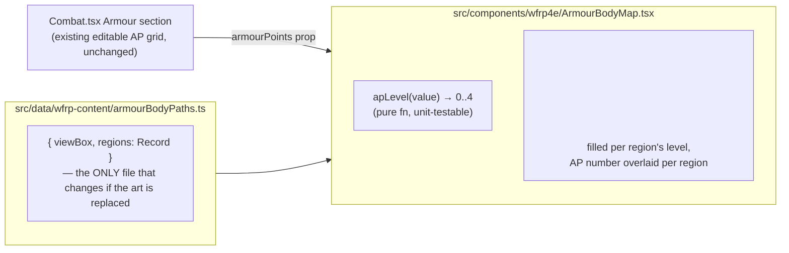

# Armour Body Diagram — Design

**Date:** 2026-08-29
**Status:** Approved design (brainstorming) → ready for implementation plan
**Topic:** A body-silhouette diagram in the WFRP4e sheet's Combat/Armour section, where each of the 6 armour locations glows brighter the more Armour Points (AP) it has — inspired by opengym's muscle-load body map, adapted for armour coverage instead of training load.

## Context

WFRP4e already fully computes per-location armour: `character.armourPoints` (`{head, rightArm, leftArm, body, rightLeg, leftLeg, shield}`) and `armourPointsByLocation()` (sums equipped armour items by location) both exist in `src/types/wfrp4e.ts`. `Combat.tsx`'s Armour section already renders these as an editable number grid laid out anatomically (head top-center, shield top-right, arms flanking body, legs below), with an "auto-fill from equipped armour" button. This feature adds a purely visual, read-only diagram alongside that existing grid — no data model changes, no changes to how AP values are edited.

Per explicit user decision, this work happens **only** in `ttrp-helper-selfhosted` — the original TTRP Helper repo is not touched, even though this feature isn't self-hosting-specific and the two repos still share the same forked WFRP4e sheet code.

The user explicitly referenced opengym's `BodyMap.jsx` (`~/Repos/opengym/frontend/src/components/BodyMap.jsx`) as the visual reference: an SVG body silhouette, split into named regions, each region's fill shaded by a value, with discrete brightness steps. opengym's region geometry (`body-paths.js`, ~90KB) is itself adapted from a third-party open-source project ("MuscleMap" by Melih Colpan, MIT licensed) into ~18 muscle-group paths across front/back views.

## Goals

- A body diagram in WFRP4e's Combat/Armour section where the 6 body-part armour locations (head, body, left/right arm, left/right leg) glow brighter with more AP, with the AP number overlaid on each region.
- Shield AP (not a body part) shown as a small badge/label beside the diagram, not on the body.
- The diagram is purely informational — all AP editing continues to happen through the existing number grid, unchanged.
- **The geometry source is easy to swap later** without touching the rendering logic — if the muscle-atlas-derived grouping doesn't look right once built, replacing it is a one-file change.

## Non-goals (explicitly out of scope)

- Any change to `TTRP-helper` (the original repo) — this ships in `ttrp-helper-selfhosted` only.
- Any change to how AP values are entered/edited (the existing `EditableNumber` grid in `Combat.tsx` is untouched).
- D&D 5e — it has a single AC value, not per-location armour; this feature doesn't apply there.
- A back-view of the body — WFRP armour coverage isn't front/back-specific, so front view only.
- Tap-to-reveal interactions on the diagram — numbers are always shown directly (per user decision), no hidden state.

## Decisions

| Area | Decision |
|---|---|
| Repo | `ttrp-helper-selfhosted` only. |
| Geometry source | Adapted from opengym's `body-paths.js` (front view only), regrouping its ~18 muscle-slug paths into 6 coarser armour zones: **body** = chest + upper-back + abs + obliques + lower-back + serratus + trapezius + deltoids; **leftArm/rightArm** = biceps + triceps + forearm, split by x-coordinate (opengym shades both arms identically since training load is symmetric; armour AP is not, so this split is new); **leftLeg/rightLeg** = gluteal + quadriceps + hamstring + adductors + hip-flexors + calves + tibialis, same left/right split; **head** = the existing head silhouette path (opengym never colors it — this feature does). |
| Attribution | The reused geometry is MIT-licensed ("MuscleMap" by Melih Colpan, via opengym). Carry the same attribution into this repo's `NOTICE.md` that opengym itself carries. |
| **Swappability (the point raised in review)** | Split into two files with a fixed interface between them: a **geometry file** exporting only `{ viewBox: string, regions: Record<ArmourLocation, string[]> }`, and a **renderer component** that takes `armourPoints` as props and draws whatever the geometry file currently exports. Replacing the art later means rewriting the geometry file to the same shape — the renderer, the glow-level logic, and the AP labels never change. |
| Visual encoding | Each region's fill brightness/saturation scales with its AP value in discrete steps (mirroring opengym's L0–L4 pattern), using the app's theme accent color, 0 AP = dim/outline only, capped at a sensible ceiling (AP 5+ = max glow) since WFRP armour rarely exceeds that. |
| Labels | AP number overlaid as text directly on each region (no tap needed). Shield AP shown as a small separate badge beside the diagram. |
| Placement | New `ArmourBodyMap` component rendered above the existing editable AP grid inside `Combat.tsx`'s Armour `Section` — additive, doesn't restructure the existing grid. |
| Rendering | `react-native-svg` (already a dependency) — `<Svg>`/`<Path>`, no new packages needed. |

## Architecture



## File layout (new)

```
src/data/wfrp-content/armourBodyPaths.ts   # geometry only — swap this file to change the art
src/components/wfrp4e/ArmourBodyMap.tsx    # renderer: glow levels, SVG paths, AP labels, shield badge
src/components/wfrp4e/__tests__/ArmourBodyMap.test.ts  # apLevel() unit tests (pure function, easy to test;
                                                         # the SVG rendering itself follows this repo's existing
                                                         # convention of no RN Testing Library component tests)
NOTICE.md                                   # new file, or an addition if repo lacks one — MIT attribution for
                                             # the reused MuscleMap-derived geometry, matching opengym's own notice
```

`Combat.tsx` gets one new import and one new component usage inside the existing Armour `Section` — no restructuring of its current content.

## Testing / verification plan

- `apLevel(apValue)` unit tests: 0 → level 0, increasing values map to increasing levels, values at/above the ceiling all map to the max level.
- Manual verification (per this project's existing convention — no RN Testing Library component tests in this codebase): open a WFRP4e character with varied AP per location, confirm each region's glow visually matches its AP (higher = brighter), confirm the shield badge shows separately, confirm editing a value in the existing grid updates the diagram, confirm the diagram doesn't interfere with the existing "auto-fill from equipped armour" button.
- Confirm `NOTICE.md`'s attribution text is present and accurate.
