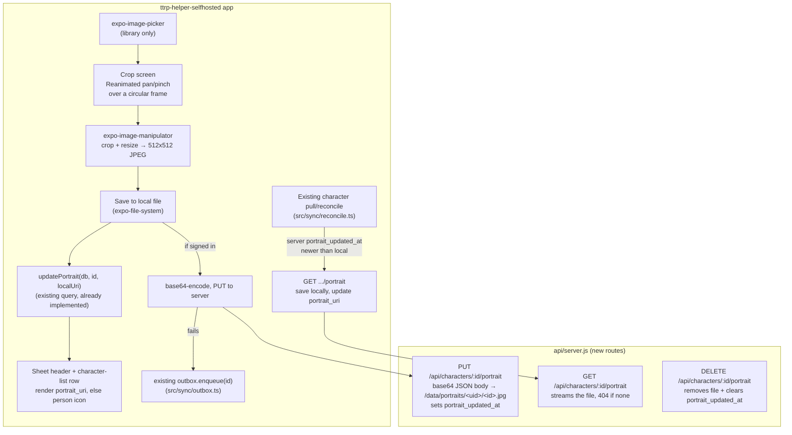

# Character Portrait Upload — Design

**Date:** 2026-08-29
**Status:** Approved design (brainstorming) → ready for implementation plan
**Topic:** Upload a photo for a character, crop it Facebook-style (pan/pinch inside a circular frame), and sync it across devices via the self-hosted server.

## Context

`portrait_uri TEXT` already exists on the local `characters` table (`src/db/schema.ts`), with `updatePortrait(db, id, uri)` already implemented (`src/db/queries.ts`) — TODO.md's "Stubbed" section notes the groundwork exists with no UI anywhere. `expo-image-picker` is already a dependency; no crop/resize library is installed yet.

This repo (`ttrp-helper-selfhosted`) replaced the original TTRP Helper's Supabase backend with its own minimal Node `http` server (`api/server.js` — no Express, no framework, hand-rolled routing) plus passkey auth and a full character CRUD sync (`GET/PUT /api/characters`, per-user JSON files under `/data`). Portraits are a fully separate path from that existing sync — `putCharacter`/`getCharacters`/`CloudCharacter` never touch `portrait_uri` today, and this design doesn't change that; it adds a parallel path alongside it.

Per user decision, this feature is **paid-tier-independent** — the original TTRP Helper's TODO had "Portrait upload (paid tier only)" as a deferred paid-tier item, but that predates this fork and RevenueCat/paywall infrastructure doesn't exist here. This ships free, same as everything else in the self-hosted fork.

## Goals

- Pick a photo from the device's library, crop it with pan/pinch inside a circular frame (image saved as a square underneath — renders correctly wherever it's shown as a circle *or* a rounded-square card), and see it immediately on the character sheet header and character-list row.
- Works fully offline / without an account (local-first, matching every other feature in this app) — portrait sync to the server is additive, not required.
- When signed in, the portrait follows the character to other devices, the same way character data already does.
- A character with no portrait shows a generic person icon, not a broken image or blank space.

## Non-goals (explicitly out of scope)

- Camera capture — library only (per decision; simpler permissions, covers the common case of uploading existing art/reference images).
- Any third-party crop library — hand-rolled pan/pinch using Reanimated (already a dependency), matching this codebase's low-dependency style and avoiding native-module crop libraries that are often unmaintained or fragile across iOS/Android/web.
- Multipart/binary upload — the existing server has no multipart parsing anywhere; portraits upload as base64 inside a JSON body, matching every other endpoint's existing style.
- Paid-tier gating — free for everyone, per decision above.
- Retrying a failed upload with anything beyond the existing outbox mechanism (no new persistent queue, no exponential backoff — matches the existing outbox's own scope).

## Decisions

| Area | Decision |
|---|---|
| Photo source | Library only (`expo-image-picker`), no camera option. |
| Crop shape | Circular mask over pan/pinch positioning; saved output is a square JPEG (512×512, quality ~0.8) so it also renders correctly as a rounded-square card, not just a circle. |
| Crop interaction | Hand-rolled Reanimated gesture handling — drag to pan, pinch to scale, clamped so the image always fully covers the circular frame (can't zoom out past "fills the frame," can't pan an edge into view). |
| Pixel crop/resize | `expo-image-manipulator` (new dependency, Expo-maintained, pairs naturally with the existing `expo-image-picker`). |
| Local storage | Always saved locally first (`expo-file-system`, app's document directory, `portraits/<characterId>.jpg`) — works with zero account, matches this app's "fully functional offline" model. `portrait_uri` (existing column) stores this local file URI. |
| Server storage | Only when signed in: same cropped bytes, base64-JSON-uploaded to a new endpoint, written to `/data/portraits/<userId>/<characterId>.jpg` on the server (same `/data` volume character/session data already lives in). |
| Cross-device sync | The server's per-character record gains `portrait_updated_at`. `GET /api/characters` (already polled/pulled today) returns it per character. A new local column, also `portrait_updated_at`, lets the client detect "server has a newer portrait than what I have" and fetch it via a new `GET .../portrait` endpoint. |
| Upload retry | Reuses the existing in-memory outbox (`src/sync/outbox.ts`) — a failed portrait upload enqueues the character id exactly like a failed character-data push does; the existing drain/reconcile cycle retries both. |
| No-photo fallback | Generic person icon (Lucide, matching the icon set already used elsewhere in the header), not initials. |
| Removing a portrait | Clears locally (`updatePortrait(db, id, null)`) and, if signed in, tells the server to delete its copy too (new `DELETE` on the portrait endpoint) — otherwise another device would re-pull the "removed" photo on its next sync. |
| Server cleanup | Character delete, character-clear, and account-delete all also remove the corresponding portrait file(s) from disk — no orphaned files. |
| Upload size cap | Reject base64 payloads over ~3MB server-side (a 512×512 JPEG at quality 0.8 is typically tens of KB — this is a generous safety margin against a malformed or malicious client, not a tight target). |

## Architecture



## File layout (new / modified)

```
# Client
src/components/ui/PortraitCropper.tsx      # pan/pinch crop screen (new)
src/components/ui/PortraitAvatar.tsx       # renders portrait_uri or fallback icon (new, used by both
                                            # the sheet header and character-list rows)
src/lib/api.ts                             # + putCharacterPortrait(id, base64), deleteCharacterPortrait(id) (modified)
src/db/schema.ts                           # + portrait_updated_at TEXT column, schemaVer bump + migration (modified)
src/db/queries.ts                          # updatePortrait() gains an optional updated_at param (modified)
src/sync/reconcile.ts                      # + pull-newer-portrait check per character (modified — exact
                                            # integration point confirmed by reading the file at plan time)
src/sync/outbox.ts                         # unchanged — reused as-is, no shape changes needed

# Server
api/server.js                              # + 3 routes (PUT/GET/DELETE portrait), portrait_updated_at
                                            # field on character records, cleanup on delete/clear/account-delete
                                            # (modified — single file, matches its existing structure)
```

`src/types/index.ts`'s `CharacterRow` gains `portrait_updated_at: string | null` alongside the existing `portrait_uri`.

## Testing / verification plan

- Server: unit-style tests (or manual `curl` verification, matching however `api/server.js` is currently tested — confirmed at plan time) for upload → fetch round-trip, size-cap rejection, 404 on missing portrait, and file cleanup on character/account delete.
- Client: `expo-image-manipulator`'s crop math isn't itself tested (it's a well-established Expo module); the clamping logic for pan/pinch (image must always fully cover the frame) is a pure-enough calculation to unit test in isolation.
- Manual verification (per this project's existing convention — no RN Testing Library component tests): pick a photo, crop it, confirm it renders on the sheet header and the character-list row immediately; sign in, confirm it appears on a second device/session after a pull; remove it, confirm it disappears on both; go offline, upload, confirm it still saves locally and the outbox eventually pushes it once back online.
