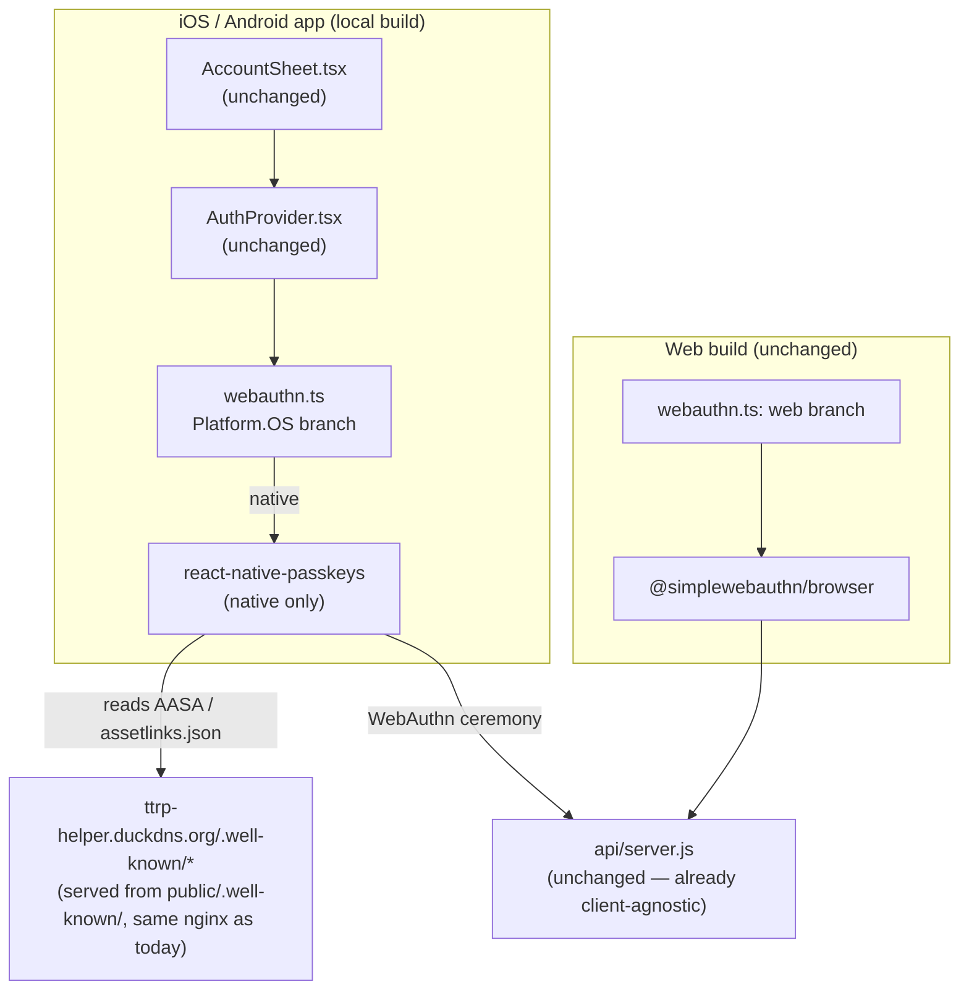

# Native Passkeys + Local Device Builds — Design

**Date:** 2026-08-29
**Status:** Approved design (brainstorming) → ready for implementation plan
**Topic:** Pick up the "native (iOS/Android) passkey support" non-goal deferred by [2026-08-28-self-hosted-passkey-fork-design.md](2026-08-28-self-hosted-passkey-fork-design.md), and set up local (no App Store / Play Store account) native builds so the app can be installed and tested on real devices.

## Context

The passkey fork shipped web-only: `src/auth/webauthn.ts` wraps `@simplewebauthn/browser`, and native builds hide the Account tab entirely (`Platform.OS === 'web'` gates in `app/(tabs)/settings.tsx` and `app/(tabs)/index.tsx`), because WebAuthn has no built-in browser API on iOS/Android and nothing in the app had ever built a custom native binary.

The user has no Apple Developer Program or Google Play Console account. Xcode is installed locally (confirmed: Xcode 26.6); the Android SDK is not. This work has two intertwined but separable halves: (1) being able to build and install the app on physical devices at all, independent of passkeys, and (2) the passkey feature itself once a native build exists to run it in.

## Goals

- Install and run this app on a real iOS device and a real Android device, entirely through local tooling — no paid developer account, no store submission.
- Passkey registration, login, and device-linking all work on native, backed by the same self-hosted `api/` (`ttrp-helper.duckdns.org`) already serving the web build — no backend changes.
- The self-hosted fork and the original TTRP Helper app can be installed side by side on one device without colliding.

## Non-goals (explicitly out of scope)

- App Store / Play Store submission, TestFlight, or any account-gated distribution — purely local/sideloaded installs for now.
- EAS Build or any Expo-account-mediated build service — both platforms build with fully local tooling (Xcode, Android Studio), matching the user's explicit choice over the cloud-build alternative.
- Unifying the web and native passkey client libraries onto one dependency — `@simplewebauthn/browser` (web, already proven) and `react-native-passkeys` (native, new) stay separate, branched inside `webauthn.ts`. Revisit only if the two ever prove painful to maintain in parallel.
- Any change to the backend (`api/server.js`) — the existing WebAuthn routes are already relying-party/client-agnostic; native is just a new client.

## Decisions

| Area | Decision |
|---|---|
| App identity | New bundle ID/package `com.juanjose220397.ttrphelperselfhosted` (was sharing the original TTRP Helper's `com.juanjose220397.ttrphelper`), display name "TTRP Helper (Self-Hosted)" — lets both apps coexist on one device. |
| iOS build | `npx expo run:ios --device`, signed by Xcode's free personal team (no paid account). Rebuild-to-refresh is an accepted tradeoff of unpaid local signing. |
| Android build | Install Android Studio locally (`brew install --cask android-studio`, then its setup wizard for the SDK), then `npx expo run:android --device`. |
| Native passkey library | [`react-native-passkeys`](https://www.npmjs.com/package/react-native-passkeys) — Expo module + config plugin, API close to `navigator.credentials`. Added only for native; web keeps `@simplewebauthn/browser`. |
| `webauthn.ts` | Gains a `Platform.OS` branch. `AuthProvider.tsx` and `AccountSheet.tsx` are unchanged — they only call this wrapper's `createPasskey`/`getPasskey`. |
| Android SDK requirement | `compileSdkVersion` bumped to 34+ via the `expo-build-properties` config plugin (the library's stated requirement). |
| Account UI native gate | The `Platform.OS === 'web'` checks added around Account UI in `settings.tsx`/`index.tsx` during the passkey fork are removed — Account UI now shows on all platforms. |
| Associated-domain files | `apple-app-site-association` and `assetlinks.json` dropped into `public/.well-known/` (Expo's web build copies `public/` verbatim into `dist/`, so no server/nginx changes needed — they're served from the already-live `ttrp-helper.duckdns.org`). |
| iOS Team ID | User-supplied: sign into Xcode with their Apple ID, read the personal team ID from Xcode → Settings → Accounts, report it back. Nobody else can produce this value. |
| Android signing fingerprint | Extracted by Claude once Android Studio/SDK exists, via `keytool -list -v -keystore ~/.android/debug.keystore -alias androiddebugkey -storepass android -keypass android` (the standard, identical-everywhere Android debug keystore). |

## Architecture



## File layout (new/changed)

```
app.json                        # new bundleIdentifier/package, display name, react-native-passkeys +
                                 # expo-build-properties plugin entries
package.json                    # + react-native-passkeys, expo-build-properties
public/.well-known/
  apple-app-site-association     # new — no file extension, JSON content, needs Team ID
  assetlinks.json                 # new — needs debug keystore SHA256 fingerprint
src/auth/webauthn.ts            # Platform.OS branch: web (unchanged) vs native (react-native-passkeys)
app/(tabs)/settings.tsx         # remove Platform.OS === 'web' gate around Account UI
app/(tabs)/index.tsx            # remove Platform.OS === 'web' gate around Account UI
```

`AuthProvider.tsx`, `AccountSheet.tsx`, and everything backend-side are untouched.

## First-run flow (once implemented)

1. iOS: sign into Xcode with an Apple ID, read the personal Team ID, report it → gets baked into `apple-app-site-association`.
2. `brew install --cask android-studio`, run its setup wizard once (installs SDK, accepts licenses).
3. Extract the debug keystore's SHA256 fingerprint → bake into `assetlinks.json`.
4. `npx expo run:ios --device` / `npx expo run:android --device` — installs the standalone app on a connected device.
5. Open the app, go to Account, register a passkey for real — Face ID / Touch ID (iOS) or the device's fingerprint/Google Password Manager prompt (Android) should appear, matching the same self-hosted backend the web build already talks to.

## Testing / verification plan

- `npx expo run:ios --device` and `npx expo run:android --device` both succeed and install without a paid developer account.
- Non-auth core (create/edit/delete a character, dice) works identically to before on both native builds — this is a regression check, since local native SQLite (not `wa-sqlite`) is a different code path from the web build.
- Both the self-hosted fork and (if the user has it installed) the original TTRP Helper app are present on the same device simultaneously without one overwriting the other.
- Passkey registration completes for real on both a physical iOS device and a physical/emulated Android device, hitting `ttrp-helper.duckdns.org`.
- A character created on one native device syncs and appears after signing in with the same passkey-linked account on the web build (or another device) — the actual end-to-end proof the original passkey-fork plan couldn't produce in a sandboxed browser.
- Device-linking flow (`Add this device` / `I have a code from another device`) works between a native device and the web build, and between two native devices.
