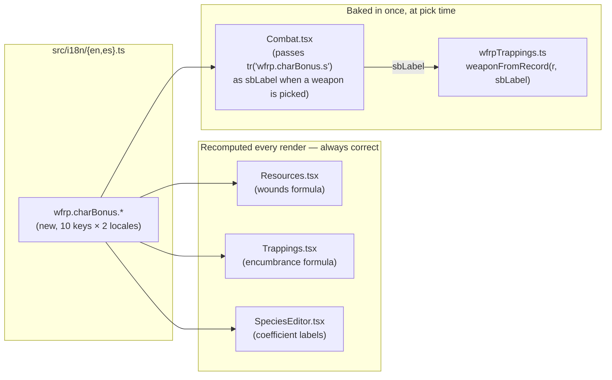

# Characteristic Bonus Abbreviations — Spanish Localization Design

**Date:** 2026-08-30
**Status:** Approved design (brainstorming) → ready for implementation plan
**Topic:** WFRP4e "characteristic bonus" abbreviations (SB, TB, WPB, etc.) are hardcoded in English in 4 places — fix them to follow the active locale, for all 10 characteristics, matching the app's existing (already-shipped) characteristic-abbreviation translation.

## Context

This is feature 2 of 4 requested in this session; feature 1 (Critical Wounds) already shipped. Each gets its own spec → plan → build cycle.

The app already ships translated single-characteristic abbreviations (`wfrp.char.*`, e.g. `s: 'S'` in English, `s: 'F'` in Spanish — Devir-edition terms). What's missing is the derived "characteristic **bonus**" label WFRP4e uses throughout its rules text (Strength Bonus, Toughness Bonus, etc. — the floor(value/10) figure used in damage, wounds, encumbrance, and other formulas). The naming convention differs by language, not just the letters: English suffixes the base abbreviation with "B" (S→SB), Spanish prefixes it with "B" (F→BF) — confirmed by the user for S/T/WP; the other 7 are extrapolated from the same pattern and confirmed correct.

Found 4 places in the codebase with this hardcoded in English:
- `src/lib/wfrpTrappings.ts:24` — weapon damage string (`` `SB+${dmg}` ``), baked into the weapon's stored text **once**, when picked from the book content (or typed manually) — not recomputed on later renders.
- `src/components/wfrp4e/Resources.tsx:76` — the Max Wounds formula display, recomputed every render.
- `src/components/wfrp4e/Trappings.tsx:109` — the encumbrance formula display, recomputed every render.
- `src/components/wfrp4e/SpeciesEditor.tsx:85-87` — the Max Wounds coefficient editor's `× SB` / `× TB` / `× WPB` labels, recomputed every render.

## Goals

- Translated characteristic-bonus abbreviations for all 10 characteristics (not just the 3 currently displayed anywhere), matching real WFRP4e rules terminology, so a future feature referencing e.g. Ballistic Skill Bonus doesn't hit this same gap.
- All 4 existing hardcoded sites use the translated label and update immediately on locale switch, wherever that's actually possible (see the weapon-damage exception below).

## Non-goals (explicitly out of scope)

- Retroactively re-localizing already-saved weapon damage text. Weapon damage is free text (typed manually, or baked in once when picked from the book) — fixing the *pick-time* construction is in scope; a structured-data rewrite so existing text re-localizes live is explicitly not, since damage's free-text nature (a player can type anything, not just "SB+N") means that rewrite wouldn't cleanly cover every case anyway for what's fundamentally cosmetic text.
- Any change to *when* a weapon's damage includes a bonus (the `dmgSbMult` flag's own logic is untouched) — only the label text changes.
- Any change to the original `TTRP-helper` repo — `ttrp-helper-selfhosted` only, per established preference.

## Decisions

| Area | Decision |
|---|---|
| New i18n keys | `wfrp.charBonus.{ws,bs,s,t,i,ag,dex,int,wp,fel}` in both `src/i18n/en.ts` and `src/i18n/es.ts`, alongside the existing `wfrp.char.*` block. |
| EN values | `ws: 'WSB'`, `bs: 'BSB'`, `s: 'SB'`, `t: 'TB'`, `i: 'IB'`, `ag: 'AgB'`, `dex: 'DexB'`, `int: 'IntB'`, `wp: 'WPB'`, `fel: 'FelB'`. |
| ES values | `ws: 'BHA'`, `bs: 'BHP'`, `s: 'BF'`, `t: 'BR'`, `i: 'BI'`, `ag: 'BAg'`, `dex: 'BDes'`, `int: 'BInt'`, `wp: 'BV'`, `fel: 'BEm'`. |
| `Resources.tsx`, `Trappings.tsx`, `SpeciesEditor.tsx` | Direct swap: replace the hardcoded `'SB'`/`'TB'`/`'WPB'` (and `× SB` etc.) text with `tr('wfrp.charBonus.s')` / `tr('wfrp.charBonus.t')` / `tr('wfrp.charBonus.wp')`. These already recompute every render, so this alone makes them locale-correct immediately, including on an already-open sheet when the user switches locale live. |
| `wfrpTrappings.ts`'s `weaponFromRecord()` | Gains a new required parameter, `sbLabel: string` — the caller passes its own already-resolved `tr('wfrp.charBonus.s')`, keeping this file itself free of any i18n import (it's a pure data-transform utility today; this preserves that). Only fixes newly-picked weapons going forward, per the non-goals above. |

## Architecture



## File layout (modified only — no new files)

```
src/i18n/en.ts                              # + wfrp.charBonus.* (10 keys)
src/i18n/es.ts                              # + wfrp.charBonus.* (10 keys)
src/lib/wfrpTrappings.ts                    # weaponFromRecord gains sbLabel param
src/components/wfrp4e/Combat.tsx            # passes tr('wfrp.charBonus.s') to weaponFromRecord
src/components/wfrp4e/Resources.tsx         # hardcoded SB/TB/WPB → tr('wfrp.charBonus.*')
src/components/wfrp4e/Trappings.tsx         # hardcoded SB/TB → tr('wfrp.charBonus.*')
src/components/wfrp4e/SpeciesEditor.tsx     # hardcoded × SB/TB/WPB labels → tr('wfrp.charBonus.*')
```

## Testing / verification plan

- No new pure logic to unit test — this is entirely label substitution in existing render paths and one existing pure-function's parameter.
- Manual verification: switch the app to Spanish, confirm Resources/Trappings/SpeciesEditor show `BF`/`BR`/`BV` immediately (no reload needed, since they recompute live); pick a new weapon with Strength Bonus damage from the book content picker while in Spanish, confirm it saves as `BF+N` rather than `SB+N`; switch back to English, confirm everything reverts correctly (live sections immediately, weapon text stays whatever it already was, matching the documented non-goal).
