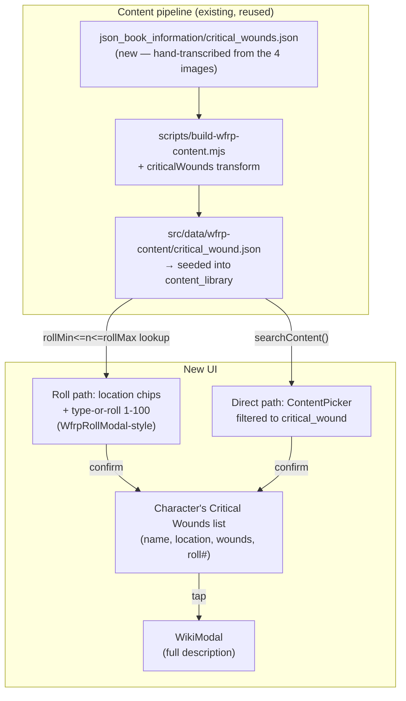

# Critical Wounds — Design

**Date:** 2026-08-30
**Status:** Approved design (brainstorming) → ready for implementation plan
**Topic:** Track WFRP4e Critical Wounds (Head/Body/Arm/Leg) on a character sheet — look one up by rolling or typing 1-100, or by searching for it by name, and keep a list of the character's current ones with their effect text.

## Context

This is feature 1 of 4 requested in this session (in stated order: critical wounds, Spanish weapon-bonus localization, sort talents by name, Hammergen import). Each gets its own spec → plan → build cycle; this doc covers critical wounds only.

The user provided 4 images (`critical_injuries_table/{head,body,arm,leg}.png`) — a fan-made "WFRP4th – Critical Hits Reference Sheet v1.04" by jakob@bindslet.dk, not a scan of the official Cubicle 7 book — containing the full Critical Wounds tables (WFRP4e's own RAW term; the images are titled "HEAD CRITICAL WOUNDS" etc., not "Critical Injuries"). Each table has ~19-20 rows: a d100 roll range, a short name, a Wounds number (or "Death" on 00), and an "Additional Effects" paragraph describing the mechanical result (often referencing WFRP4e's separate Conditions system — Bleeding, Stunned, Prone, etc. — and sometimes conditional, e.g. "Pass a Hard (−20) Endurance Test or gain the Unconscious Condition").

This repo already has an established content pipeline for exactly this kind of book-derived reference data: raw dumps in `json_book_information/*.json` → `scripts/build-wfrp-content.mjs` transforms them into `src/data/wfrp-content/<category>.json` → seeded into the `content_library` SQLite table → searchable via `ContentPicker`/`searchContent`, viewable via `WikiModal`. Critical Wounds slots into this pipeline as an 11th content category, reusing all of it — no parallel system needed. There's no existing raw dump for Critical Wounds (unlike skills/talents, which already had Foundry-derived source files); the 4 images become a new hand-transcribed raw file.

## Goals

- Full Critical Wounds data (all 4 locations, all rows, from the provided images) as a new searchable/browsable content category, following this repo's existing content pipeline exactly.
- Add a Critical Wound to a character two ways, both first-class (neither is a fallback for the other): roll or type 1-100 within a chosen location and get the matching result, or search/pick by name directly across all locations.
- A rolled entry keeps its roll number visible (matching how other rolled results in this app stay visible, not just their outcome); a directly-picked entry has no roll number.
- View a character's current Critical Wounds (name, location, wounds severity, roll number if any) and their full effect text; remove one when healed.

## Non-goals (explicitly out of scope)

- Conditions (Bleeding, Stunned, Prone, etc.) as their own generic trackable/stacking system — explicitly deferred to a possible separate future feature. Critical Wound effect text will *mention* conditions in its free-text description, same as it mentions Endurance Tests and other rules terms, but nothing in this feature parses or tracks conditions.
- Parsing/auto-applying any part of a Critical Wound's effect text (e.g. auto-granting the conditions or wounds it mentions) — the text is for the player to read and apply themselves, same as talent/skill/spell descriptions already work in this app.
- Wiring the `wounds` severity number into any wound-total calculation — it's the table's own documentation of severity, shown for reference only.
- Left/right distinction for arm/leg — WFRP4e's Critical Wound tables are location-*type* only (one Arm table covers either arm), matching the source images exactly.
- Any change to the original `TTRP-helper` repo — `ttrp-helper-selfhosted` only, per established preference.

## Decisions

| Area | Decision |
|---|---|
| Content category | New `critical_wound` category, 11th alongside skill/talent/spell/prayer/trapping/quality/mutation/creature_trait/rune/career — same `ContentCategory`/`ContentRecord`/`CONTENT_SOURCES` plumbing, same seeding, same search. |
| Record shape | `{ id, name, location: 'head' \| 'body' \| 'arm' \| 'leg', rollMin, rollMax, wounds: number \| 'death', description }` — `description` is the "Additional Effects" text, transcribed as-is (it's functional/mechanical text, not narrative prose to paraphrase). |
| Raw source | Hand-transcribed from the 4 images into `json_book_information/critical_wounds.json`, following the existing raw-dump convention (one new file, not modifying any existing raw dump). A new `criticalWounds` transform added to `scripts/build-wfrp-content.mjs`'s `TRANSFORMS` object, matching the existing `skills`/`talents` transform pattern exactly. |
| Attribution | New `NOTICE.md` entry crediting jakob@bindslet.dk's reference sheet (name + version), matching how the armour diagram's MIT-licensed art was credited. |
| Character storage | `Wfrp4eCharacter.criticalWounds: Array<{ id, name, location, wounds, description, roll: number \| null }>` — a denormalized snapshot copied at add-time (matching how `talents`/`GrantedTalent` already work), not a foreign key, so export/import and future content updates don't retroactively change what's on a character's sheet. `roll` is the 1-100 value used if added via the roll path, `null` if added by direct search. |
| Add flow — roll path | Pick a location (4 chips), then type or roll 1-100 (same manual-roll-entry UI as `WfrpRollModal`'s existing pattern) → shows the matching table entry (looked up by `rollMin <= n <= rollMax` within that location) → confirm to add. |
| Add flow — direct path | `ContentPicker` filtered to category `critical_wound` (no location filter — search spans all four), same tap-to-select-and-prefill pattern already used for talents/skills/spells. |
| List display | Each row: name, location, wounds badge, "Roll N" badge when `roll` is set. Tap opens full `description` via the existing `WikiModal` component. |
| Remove | Trash icon on each row, same as Talents/Weapons/Armour already work. |
| Placement | New "Critical Wounds" subsection near Resources.tsx (which already shows Wounds/Fate/Fortune) — exact component boundaries (new file vs. added to Resources.tsx) decided at plan-writing time by checking that file's current size/structure. |

## Architecture



## File layout (new / modified)

```
json_book_information/critical_wounds.json      # new raw dump (hand-transcribed)
scripts/build-wfrp-content.mjs                   # + criticalWounds transform, registered in TRANSFORMS
src/data/wfrp-content/critical_wound.json        # generated by the build script
src/data/wfrp-content/index.ts                   # + 'critical_wound' in ContentCategory/CONTENT_SOURCES
src/types/wfrp4e.ts                              # + criticalWounds field on Wfrp4eCharacter, migration
                                                  #   (new field on an existing type needs the same
                                                  #   migrate-on-load treatment other added fields got)
src/components/wfrp4e/CriticalWounds.tsx         # new section component (or folded into Resources.tsx —
                                                  #   decided at plan time based on that file's current size)
NOTICE.md                                        # + attribution entry for the reference sheet
```

## Testing / verification plan

- A pure lookup function (`rollMin <= n <= rollMax` within a location → matching record) gets a unit test once its exact location lives (likely alongside the new section component or in a small lib file) — this is genuinely testable logic, unlike free-text content.
- Data correctness: spot-check a sample of transcribed entries (e.g. the four 00-roll "Death" results, a few mid-table entries) against the source images during the plan's manual verification pass.
- Manual verification (per this project's existing convention — no automated tests for UI or for content JSON accuracy beyond spot-checks): add a Critical Wound via both paths (roll and direct search), confirm the roll number shows only for the roll path, confirm the description opens in `WikiModal`, confirm remove works, confirm a D&D 5e character never sees this section (WFRP4e-only, same as the armour diagram).
