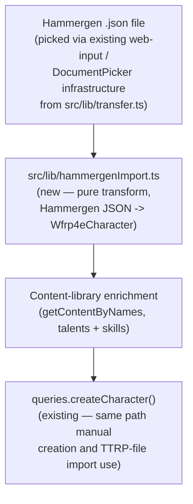

# Hammergen Character Import — Design

**Date:** 2026-08-30
**Status:** Approved design (brainstorming) → ready for implementation plan
**Topic:** Import a WFRP4e character from a Hammergen JSON export into `ttrp-helper-selfhosted`.

## Context

This is feature 4 of 4 requested in this session; features 1-3 (Critical Wounds, Spanish characteristic-bonus i18n, talent sort) already shipped. The user provided a real sample export (`Olaf Frostbrew.json.txt`, a Dwarf Brewer character) to build the mapping from.

Every field in the sample was compared against this repo's `Wfrp4eCharacter` type (`src/types/wfrp4e.ts`). Most fields map cleanly and mechanically; a handful needed real design decisions, resolved below. The sample happens to have empty `spells`/`prayers`/`traits`/`mutations` arrays — those mappings are inferred from this app's own equivalent field shapes, not verified against a populated Hammergen example. If a real spellcaster's export breaks the assumed shape, that's a follow-up fix, not a blocker for shipping this against the verified fields.

This app already has: a seeded, searchable WFRP4e content library (`content_library` table, `getTalentsByNames()` in `src/db/queries.ts`) used by the existing "Random Talent" feature; an existing import mechanism (`src/lib/transfer.ts`'s `pickAndParseCharacter`, triggered from an upload icon in `app/(tabs)/index.tsx`) that validates a file is literally this app's own export format and does zero transformation — Hammergen's format needs real parsing, so it gets its own function, though the underlying file-picking code (web `<input type=file>` vs native `DocumentPicker`) is directly reusable.

## Goals

- Pick a Hammergen JSON export and create a new WFRP4e character from it, with every field that has a reasonable home actually populated — not just the easy ones.
- Nothing Hammergen exports is silently discarded without at least ending up in `notes` if it has no better home.
- Imported talents and skills get their real book description/tests auto-filled by looking them up against this app's own content library, the same way "Random Talent" already does.
- A new "Import from Hammergen" option next to the existing import action — explicit, no format-guessing.

## Non-goals (explicitly out of scope)

- D&D 5e import (Hammergen is WFRP4e-only; this app's D&D side has no equivalent external tool to import from).
- Any change to the existing "import a TTRP Helper export" flow — it keeps working exactly as it does today, this adds a second option alongside it.
- Handling a Hammergen export with a genuinely different shape than the one sample verified here (e.g. an actual spellcaster) — the mapping for spells/prayers/traits/mutations is a best-effort inference; fixing it if it turns out wrong is a follow-up, not part of this task.
- Computing/displaying a weapon's *resolved* damage (bonus + flat number) — noted as a separate near-term TODO, out of scope here. This import just carries over whatever bare number Hammergen exported, flagged for manual review (see Decisions).
- Any change to the original `TTRP-helper` repo — `ttrp-helper-selfhosted` only, per established preference.

## Decisions

| Area | Decision |
|---|---|
| Career | Parse the trailing digit off `currentCareer.name` ("Brewer 2" → rank 2) and each `pastCareers[].name` the same way. Sort all of them (past + current) by rank; `careerPath[rank-1] = levelName` for each. `currentCareer` (this app's field) = the *current* rank's `levelName` ("Brewer", not "Brewer 2"). `careerRank` = the current rank number. |
| Career class (new) | Hammergen's `className` ("Burghers") has no existing home — add a new **optional** field `careerClass?: string` to `Wfrp4eCharacter`, populated from `className` on import (manually-created characters simply won't have it). Displayed in `Wfrp4eHeader.tsx` next to the existing career/rank display, **only when present** — no UI change for characters that don't have it. |
| Fate / Fortune / Resilience / Resolve | Hammergen's single number becomes both `current` and `max` (treated like a fresh session start — there's no reliable way to know how much was already spent from the export alone). |
| Experience | `spentExp` → `spent`, `totalExp` → `total`. Hammergen's own `currentExp` is ignored — this app always derives current as `total - spent` itself, so trusting that formula over Hammergen's separately-stored number is consistent with how the app already works everywhere else. |
| Species / Origin | Hammergen's `species` packs both together, e.g. `"Dwarf (Zhufbar)"`. Parsed as `"<species> (<origin>)"` → this app's separate `species`/`origin` fields. If the pattern doesn't match (no parenthetical), the whole string becomes `species` and `origin` stays empty — never throws on an unexpected shape. |
| Bio fields | `description` is a packed string, e.g. `"Age: 61, Height: 5'1\", Eyes: Hazel, Hair: Dark Brown"` — parsed with one regex per piece into this app's real `age`/`height`/`eyeColor`/`hair` fields. Any piece not found in the string is left at that field's normal default rather than failing the whole import. |
| `size` field | No home in this app's model at all (WFRP4e size is derivable from species anyway) — appended into `notes` (e.g. `"Imported from Hammergen. Size: Average."`) so it's not silently lost even though nothing displays it structurally. |
| Gear buckets | Hammergen's `equippedArmor`/`equippedWeapon`/`equippedOther` → this app's `armour`/`weapons`/`trappings` respectively, all `equipped: true`. `carried` and `stored` both → `trappings` with `equipped: false` — nothing is excluded; anything unwanted can be deleted after import same as any manually-added item. Each item's `qualitiesFlaws: [{name}]` array joins into this app's flat `qualities` string (e.g. `"Defensive, Entangle, Undamaging"`). |
| Weapon damage | Imported as the bare number Hammergen exports (e.g. `"6"`), with `notes` appended: *"Imported from Hammergen — verify if this should include a Strength Bonus."* No attempt to infer or add a bonus automatically. |
| Talent/skill enrichment | Each imported talent/skill is looked up by name (case-insensitive) against the local content library and, on a match, gets its real `description`/`tests`/`page` (talents) or `description` (skills) filled in — same underlying mechanism "Random Talent" already uses. No match (e.g. a homebrew talent) → imports bare, same as manually typing a custom one today. |
| Content-lookup refactor | `getTalentsByNames()` (`src/db/queries.ts`) is hardcoded to `category = 'talent'` — generalized into `getContentByNames(db, category, names, locale)` so it also serves skill lookups here, with the one existing call site (`Talents.tsx`'s `rollRandom()`) updated to pass `'talent'` explicitly. A direct, small refactor serving this feature, not a speculative cleanup. |
| Import entry point | The existing upload icon (`app/(tabs)/index.tsx`) gains a second option alongside "Import TTRP Helper file": **"Import from Hammergen"**. Explicit choice, no file-shape auto-detection. |
| Verified vs. inferred | `spells`/`prayers`/`traits`/`mutations` mappings are inferred from this app's own equivalent shapes (the sample has none of these populated) — accepted as a known risk, to be corrected against a real example if one ever breaks it, rather than blocking this design on a field nobody has confirmed yet. |

## Architecture



## File layout (new / modified)

```
src/lib/hammergenImport.ts          # new — pure parsing/mapping functions, unit-testable
src/lib/transfer.ts                 # + pickHammergenFile() (reuses existing web/native file-pick code)
src/db/queries.ts                   # getTalentsByNames -> generalized getContentByNames(category, ...)
src/components/wfrp4e/Talents.tsx   # rollRandom() updated to call getContentByNames(db, 'talent', ...)
src/types/wfrp4e.ts                 # + careerClass?: string field, migration default
src/components/wfrp4e/Wfrp4eHeader.tsx  # show careerClass next to career/rank, only when present
src/hooks/useCharacterList.ts       # + importHammergenCharacter() alongside existing importCharacter()
app/(tabs)/index.tsx                # import icon gains a second "Import from Hammergen" option
```

## Testing / verification plan

- `src/lib/hammergenImport.ts`'s mapping functions are pure (JSON in, `Wfrp4eCharacter` fields out) — real unit tests against the actual sample file's data for: career rank/path parsing, species/origin split, description-field parsing (including the "field not found" fallback case), characteristic reconstruction (`roll+advances+other` against Hammergen's own `attributes` totals), and gear-bucket routing.
- Manual verification (per this project's existing convention — no automated tests for the UI layer): import `Olaf Frostbrew.json.txt` for real, confirm the resulting character sheet matches the source data field-by-field, confirm talents/skills picked up real book descriptions where they exist, confirm the existing "Import TTRP Helper file" option still works unchanged.
